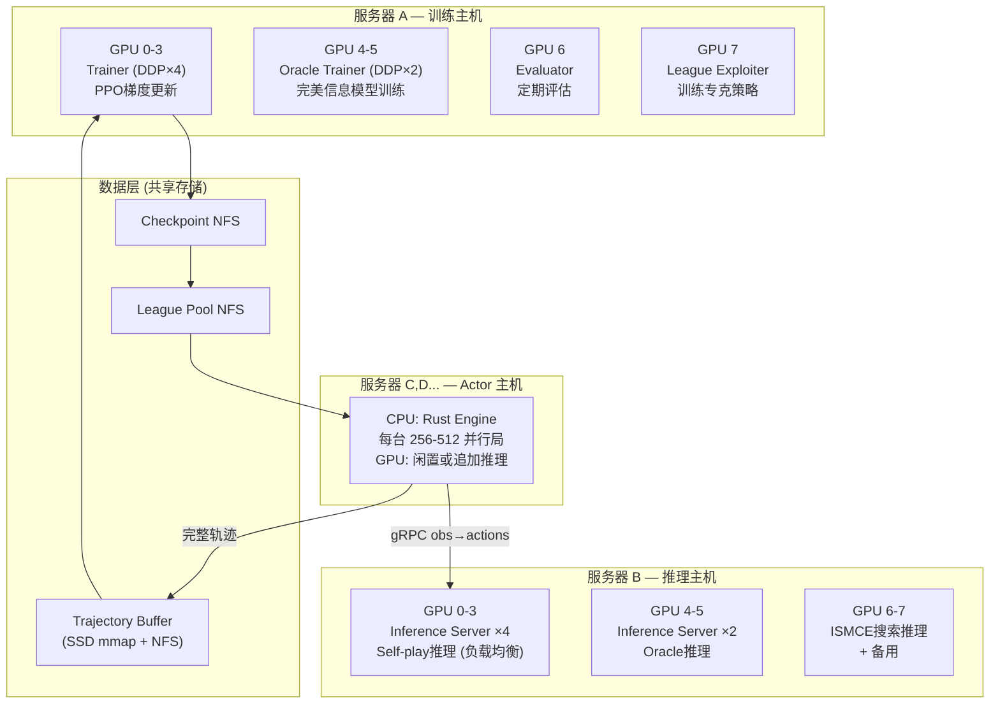
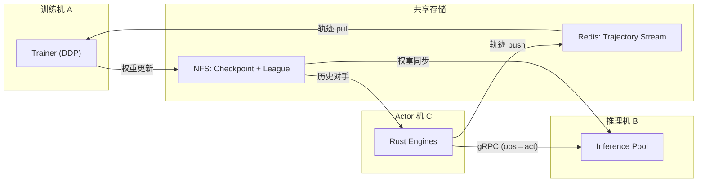
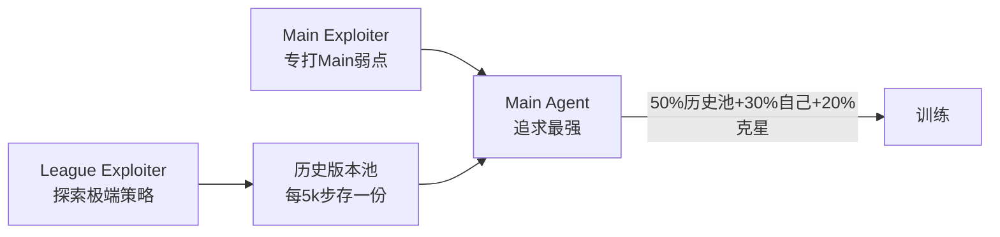

# 血战到底 V2 — 超人类级完整系统架构 (总纲)

> **目标**：构建一套可在 GPU 集群上分布式训练的、完全自包含的血战到底超人类 AI。
> **对标**：微软 Suphx（日麻超人类）+ DeepMind AlphaStar（联赛系统）+ Google SEED RL（分布式架构）。
> **原则**：完全独立项目，不依赖任何 V1 代码。

---

# 第一部分：系统架构 (8×4090 多机集群优化)

## 1. 硬件资源与角色分配

> **硬件**：多台 8×RTX 4090 (24GB VRAM each) 服务器

每台 8×4090 服务器的 8 张 GPU 按**角色分区**使用：



### GPU 角色分配方案

> **网络要求**：服务器间需 **10Gbps+ 万兆网卡** (gRPC 推理峰值 ~2.3 GB/s)

| 场景 | 服务器数 | GPU 分配 | CPU 分配 | 总并行局数 | 预估吞吐 |
|------|---------|---------|---------|----------|--------|
| **单机开发** | 1台 | G0:推理, G1-2:训练DDP, G3:Oracle/评估 | Rust Actor×256 | 256 | ~2k局/秒 |
| **双机标准** | 2台 | A:G0-3训练+G4-5Oracle+G6评估+G7Exploiter, B:G0-5推理+G6-7备用 | 两台CPU均跑Actor×512 | 1024 | ~10k局/秒 |
| **三机生产** | 3台 | A:训练8卡, B:推理6卡+ISMCE2卡, C:CPU Actor | C全CPU跑Actor×1024 | 4096+ | ~30k局/秒 |
| **四机极限** | 4台 | A:训练, B-C:推理, D:Actor | 各机CPU均利用 | 8192+ | ~50k局/秒 |

## 2. 分布式架构详解

### 2.1 多 GPU 推理集群 (Inference Cluster)

**核心思想**：将多张 GPU 组成推理池，用 **Round-Robin 负载均衡** 分发请求。

```
Actor Workers (Rust, CPU)
    │ gRPC
    ▼
┌────────────────────────────────┐
│     gRPC Load Balancer         │
│  (Nginx / Envoy / 自研)        │
└──┬──────┬──────┬──────┬───────┘
   ▼      ▼      ▼      ▼
 GPU0   GPU1   GPU2   GPU3
 推理    推理    推理    推理
 worker  worker  worker  worker
```

每个 Inference Worker：
- 绑定 1 张 GPU
- 接收 obs batch → `model.forward()` → 返回 actions
- 异步 batching：等待 2ms 或累积满 512 个请求后触发一次推理
- **动态 batch size**：低负载时小 batch 降延迟，高负载时大 batch 求吞吐

### 2.2 多 GPU 训练 (DDP)

使用 PyTorch **DistributedDataParallel (DDP)** 在 4-8 张 GPU 上并行训练：

```python
# 每张 GPU 处理 mini-batch 的 1/N
# 梯度通过 NCCL AllReduce 自动同步
trainer = DDPTrainer(
    model=model,
    world_size=4,           # 4张GPU
    backend='nccl',
    gradient_accumulation=2  # 等效batch_size = 4 × 1024 × 2 = 8192
)
```

| 参数 | 单 GPU | 4-GPU DDP | 8-GPU DDP |
|------|--------|-----------|-----------|
| Mini-batch/GPU | 1024 | 1024 | 1024 |
| 等效 batch | 1024 | 4096 | 8192 |
| 梯度同步 | 无 | NCCL AllReduce | NCCL AllReduce |
| 训练吞吐 | 1× | ~3.8× | ~7.2× |

### 2.3 多机通信拓扑



**权重同步策略**：
- Trainer 每 100 步发布新权重到 NFS
- Inference Server 每 **3 秒**检查 NFS 并热加载 (`model.load_state_dict`)
- 轨迹中记录 `policy_version`，版本差 > 2000 步时强制同步
- Actor 的对手权重从 League Pool 按策略采样

### 2.4 V-trace 离策略修正

由于 Inference 用的权重比 Trainer 滞后 100-1000 步：
```
ρ_t = min(ρ̄, π_new(a|s) / π_old(a|s))  # 截断重要性权重
c_t = min(c̄, π_new(a|s) / π_old(a|s))  # 截断trace系数
V_trace = V(s) + Σ γ^t (Π c_i) × δ_t    # 修正后的价值估计
```
ρ̄ = 1.0, c̄ = 1.0（标准 IMPALA 设置）

## 3. 多智能体异步决策调度

```rust
struct DecisionRequest {
    env_id: usize,
    player_id: u8,
    phase: GamePhase,
    obs: Vec<f32>,       // 67×27 flat
    discard_seq: Vec<Vec<u8>>,  // 3家舍牌序列
    mask: Vec<bool>,     // 38维
}
```

**异步管线** (每台 Actor 机内部)：
1. Rust Engine 推进 256 局直到产生 DecisionRequest
2. 所有请求打包成 batch (数百到数千个)
3. gRPC 发送给 Inference Pool 的某个 GPU Worker
4. 收到 action 后分发回对应的 Game，继续推进
5. 当一局完整结束 → 将 trajectory push 到 Redis

## 4. 容错与运维

| 场景 | 应对 |
|------|------|
| Actor 机宕机 | Learner 不受影响，轨迹产出下降但训练继续 |
| 推理 GPU 挂 | 负载均衡自动剔除，其余 GPU 接管 |
| 训练 GPU 挂 | DDP 检测到异常，从 checkpoint 重启 |
| Redis 满了 | 自动丢弃最旧轨迹，保留最新 10 万条 |
| NFS 不可达 | 本地缓存最近权重，等恢复后同步 |
| 训练发散 | Loss/ELO 监控自动回滚 (见第21节) |

---

# 第二部分：游戏引擎

## 5. 游戏 FSM

```mermaid
stateDiagram-v2
    [*] --> Deal
    Deal --> DingQue: 发牌完成
    DingQue --> Draw: 4家同时选缺
    Draw --> SelfCheck: 摸一张牌
    SelfCheck --> Discard: 无自摸/暗杠/加杠
    SelfCheck --> PostWin: 自摸
    SelfCheck --> Discard: 暗杠/加杠后补摸
    Discard --> Reaction: 打出一张
    Reaction --> Draw: 无人反应 → 下家
    Reaction --> Discard: 碰 → 碰者弃牌
    Reaction --> PostWin: 荣和
    PostWin --> Draw: 剩余≥2人 → 血战续战
    PostWin --> Scoring: 仅剩1人 或 牌墙空
    Scoring --> [*]
```



## 6. 血战到底全规则清单

| 规则 | 说明 | 对AI影响 |
|------|------|---------|
| 定缺 | 开局选一个花色，必须先全部打出 | 定缺准确率直接影响胜率 |
| 续战 | 有人胡后游戏继续，已胡者"透明出牌" | AI需理解动态缩减的对手数 |
| 一炮多响 | 一张弃牌可被多人同时荣和 | 引擎需正确结算多人得分 |
| 杠上开花 | 杠后补摸胡牌 +1番 | 杠的策略价值计算 |
| 海底捞月 | 最后一张牌自摸 +1番 | 尾局风险估计 |
| 抢杠胡 | 别人加杠时可以抢胡 | Reaction 优先级处理 |
| 查花猪 | 终局手中还有缺门牌需赔付 | 惩罚机制 |
| 查大叫 | 终局未听牌需赔付给听牌者 | 听牌意识 |
| 番数封顶 | 最高 5 番 = 16000 分 | 大牌价值有上限 |

## 7. 向听数算法

采用 **查表法 + 递归分解**，单次 < 1μs：
1. 离线预计算所有面子/雀头组合查找表
2. 在线：按花色分 3 组独立查表，合并
3. 七对子直接特判

---

# 第三部分：动作与观测空间

## 8. 动作空间 (`action_dim = 38`)

| 编号 | 动作 | 适用阶段 |
|------|------|---------|
| 0-26 | 弃牌 (tile_0 ~ tile_26) | Discard |
| 27 | 自摸 (Tsumo) | SelfCheck |
| 28 | 荣和 (Ron) | Reaction |
| 29 | 碰 (Pon) | Reaction |
| 30 | 明杠 (MinKan) | Reaction |
| 31 | 暗杠 (AnKan) | SelfCheck |
| 32 | 加杠 (KaKan) | SelfCheck |
| 33 | 过 (Pass) | Reaction |
| 34-36 | 定缺 (万/筒/条) | DingQue |
| 37 | 自动弃牌 (已胡透明) | 内部 |

## 9. 观测空间

### Student 观测 (~67 × 27 + 144 flat)

| 通道组 | 通道数 | 内容 |
|--------|--------|------|
| 自己手牌 | 4 | 持有 1/2/3/4 张 |
| 自己副露标记 | 4 | 碰/明杠/暗杠/加杠 |
| 3家舍牌历史 | 12 | 每家 4 通道 |
| 3家副露标记 | 12 | 每家 4 通道 |
| 3家是否已胡 | 3 | 布尔 |
| 全场已见牌 | 4 | 全局可见牌计数 |
| 自己定缺 | 3 | one-hot |
| 对手定缺推断 | 9 | 3人×3花色 |
| 当前触发牌 | 1 | Reaction 阶段 |
| 牌墙进度 | 1 | [0,1] |
| 分数差 | 3 | 归一化 |
| 向听估计 | 1 | 离听多远 |
| 巡目编码 | 4 | 第几巡 |
| 庄家标记 | 4 | 谁是庄家 |
| RTPA 风格参数 | 2 | V_init + style_alpha |
| **空间通道合计** | **~67** | |
| 对手风格嵌入 (flat) | 48 | 3×16 GRU |
| 舍牌序列编码 (flat) | 96 | 3×32 Transformer |

### Oracle 额外观测 (+28 通道)
| 3家真实手牌 (12) | 牌墙剩余 (4) | 对手真实定缺 (9) | 对手向听数 (3) |
|:---:|:---:|:---:|:---:|

---

# 第四部分：神经网络

## 10. 网络架构

```
观测 (B, 67, 27)        舍牌序列 (B, 3, T)     对手风格 (内嵌)
    │                        │                      │
    ▼                        ▼                      │
SuitAwareConv (×2)     DiscardSeqTransformer        │
  + BN + Mish           (2层, 4头, dim=32)          │
    │                        │                      │
    ▼                        ▼                      │
Transformer Enc        3 × mean_pool → (96,)        │
 (6层, 8头, dim=256)        │                      │
    │                        │                      │
    ▼ Flatten (6912)         │                      ▼
    │                        │              GRU → 3×(16,) → (48,)
    └──────────── Concat ────┴──────────────────────┘
                    │
                    ▼ (6912 + 96 + 48 = 7056)
              MLP → (1024) + LayerNorm + Mish
               ┌────────┴────────┐
          Actor (38)        Critic (1)
               │
         AuxHeads: 对手等待(81), 向听(1), 定缺(3)
```

**总参数量**：~13M

---

# 第五部分：训练算法

## 11. PPO + V-trace

| 参数 | 值 |
|------|------|
| 算法 | PPO (本地) / V-trace (分布式离策略修正) |
| GAE λ | 0.95 → 0.97 |
| Clip ratio ε | 0.2 → 0.1 |
| Value loss coef | 0.5 |
| 梯度裁剪 | max_norm = 0.5 |

## 12. 奖励设计

```
reward = Δscore / 16000    # 归一化到 [-1, 1]
```
- 每次有人胡牌时产生即时奖励（非回合末结算）
- 终局查花猪/查大叫的赔付也算入

## 13. 花色置换数据增强

万/筒/条完全对称 → 每条轨迹生成 3! = 6 种排列，免费 ×6 样本量。在 DataLoader 层做。

## 14. Oracle 蒸馏

1. 先训 Oracle（完美信息 PPO）至收敛
2. Student loss 加入 `α × KL(π_student ‖ π_oracle)`
3. α: 1.0 → 0.1 线性衰减

## 15. 运行时策略自适应 (RTPA)

- 开局用 Value Head 估计 `V_init`
- 映射为风格参数 α（进攻/防守）
- 网络输入附加 `style_embedding(α)` 通道

## 16. ISMCE 推理增强

| 步骤 | 内容 |
|------|------|
| 触发 | 牌墙 ≤ 40 且估计有人听牌 |
| 采样 | 5ms 内生成 64 个暗牌分布 |
| 评估 | Value Head 对每个候选弃牌取期望 |
| 修正 | `Q_adj(a) = Q_policy(a) - β × danger(a)` |

---

# 第六部分：训练体系

## 17. 课程学习

| 阶段 | 步数 | 对手 | 奖励 | 目标 |
|------|------|------|------|------|
| 热身期 | 0-50k | 规则Bot+随机 | score_diff + 行为奖励 | 学基本规则 |
| 竞争期 | 50k-500k | Self-play + 历史池 | 纯 score_diff | 攻防平衡 |
| 精英期 | 500k+ | League System | score_diff + Oracle蒸馏 | 超人类 |

热身期行为奖励：定缺清空+0.05, 胡牌+0.1, 放铳-0.05（50k步后关闭）

## 18. 冷启动：规则 Bot

```
if 定缺阶段: 选持有最少张数的花色
elif 手中有缺门牌: 打缺门牌（张数少的优先）
elif 能自摸: 胡
elif 能碰且碰后向听数不变或减少: 碰
else: 打最不影响向听数的牌
```

前 10k 步与规则 Bot 对弈，之后切换 Self-play。

## 19. League System



## 20. 超参数调度表

| 超参数 | 热身 (0-50k) | 竞争 (50k-500k) | 精英 (500k+) |
|--------|-------------|-----------------|-------------|
| 学习率 | 3e-4 | 1e-4→3e-5 cosine | 3e-5→1e-5 |
| Entropy coef | 0.03 | 0.01 | 0.003 |
| GAE λ | 0.95 | 0.95 | 0.97 |
| γ | 0.99 | 0.995 | 0.999 |
| Oracle α | 0 | 0 | 1.0→0.1 |
| Mini-batch | 256 | 512 | 1024 |
| 花色增强 | ×2 | ×4 | ×6 |

## 21. 训练稳定性保护

| 机制 | 触发条件 | 动作 |
|------|---------|------|
| Loss 爆炸 | policy_loss > 10 | 跳过 batch |
| 梯度 NaN | 参数出现 NaN | 回滚 checkpoint |
| ELO 崩塌 | 连续 3 次评估恶化 | 回滚 + 学习率 ×0.5 |
| Entropy 坍缩 | entropy < 0.1 | entropy_coef ×2 |
| KL 发散 | 蒸馏 KL > 10 | α ×0.5 |
| 定期备份 | 每 1000 步 | 完整 checkpoint |
| 最佳保留 | avg_ranking 创新低 | 存为 best.pt |

---

# 第七部分：评估与部署

## 22. 评估协议

| 指标 | 超人类目标 |
|------|----------|
| avg_ranking (1000局) | < 1.8 |
| point_per_round | > +500 |
| win_rate | 28-35% |
| deal_in_rate | < 18% |
| mean_fan | > 2.2 |

评测：Main Agent vs League Pool 最强 3 版本，打 2000 局取均值。

## 23. 部署对弈服务

```
人类/其他AI → [WebSocket 网关] → [GPU 推理 + ISMCE 搜索] → 返回动作+概率+解读
```

```json
{ "action": 5, "action_probs": {"0": 0.12, "5": 0.65},
  "value": 0.42, "thinking": "向听=1, 危险牌=[3m,7p], 选安全牌5s" }
```

---

# 第八部分：项目结构与交付

## 24. 目录结构

```
blood-v2/
├── Cargo.toml                  # Workspace
├── config.toml                 # 统一配置
├── proto/inference.proto       # gRPC 定义
├── engine/                     # 阶段A: 纯规则引擎
│   └── src/ (tile, hand, win, game, actions, obs)
├── batch_env/                  # 阶段B: 批处理+通信
│   └── src/ (batched, bridge, pybind)
├── trainer/                    # 阶段C: 训练管线
│   └── (network, ppo, oracle, self_play, evaluator, logger, checkpoint, main)
├── inference_server/           # 阶段D: gRPC推理服务
│   └── (server.py, client.rs)
├── deploy/                     # 阶段G: 对弈服务
│   └── (gateway.py, api.py)
└── tests/
```

## 25. 交付里程碑

| 阶段 | 交付物 | 验收标准 |
|------|--------|---------|
| **A** | 完整游戏引擎 | 1000局 random play 无 panic + 全番型测试通过 |
| **B** | 批处理环境 | Python 调用 Rust 跑完 100 局 + obs/mask 维度正确 |
| **C** | 单机训练 | 10k 步后 avg_ranking < 2.8（优于随机） |
| **D** | 分布式训练 | 4 Actor + 1 Learner 稳定跑 100k 步 |
| **E** | Oracle 蒸馏 | deal_in_rate 降至 < 25% |
| **F** | ISMCE | point_per_round 提升 > 30% |
| **G** | 对弈部署 | 人类可通过 WebSocket 与 AI 实时对局 |

> [!IMPORTANT]
> **基础不牢，地动山摇** — 阶段 A 必须 100% 覆盖所有血战到底规则后才进入下一阶段。
